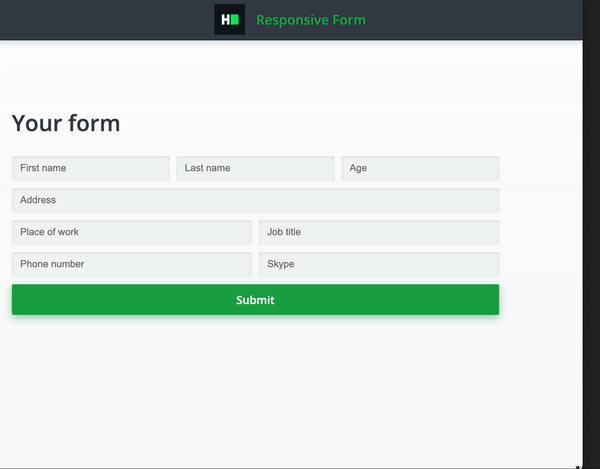
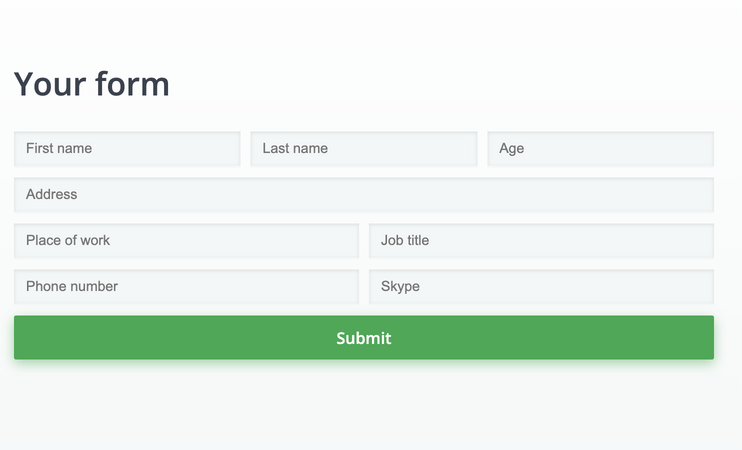
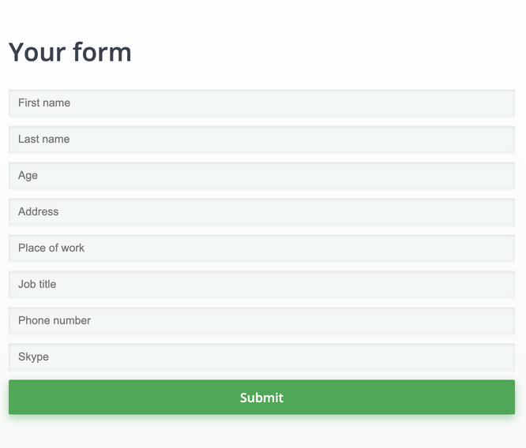

# CSS: Responsive Form

Complete a partially completed application. Complete the application shown below in order to pass
all the unit tests.

## Environment

- Node Version: ^12.18.3
- Default Port: 8000

## Application Demo:



### Desktop version



### Mobile version



## Application description

Complete a website layout application with the following UI:

You form contains 8 input fields and a submit button.

Position all components the way described below:

- All elements should have 10px margin from each other
- For the desktop layout (screen width ≥768px):
  - "First name", "Last name" and "Age" fields should be positioned on the first row and have equal width.
  - The "Address" field should be positioned on the second row and take the width of the form.
  - The "Place of work" and "Job title" fields should be positioned on the third row and have equal widths.
  - The "Phone number" and "Skype" fields should be positioned on the fourth row and have equal widths.
  - The button should be positioned on the last row and take the width of the form.
- For the mobile layout (screen width <768px):
  - All fields should take whole width of the form.
- Elements should not have `position: absolute`.

All the markup for the question has been added. As a candidate, you have to complete the CSS file to implement the
above-stated features.

## Project Specifications

**Read Only Files**

- `test/*`
- `src/index.js`
- `src/index.html`
- `src/css/readonly.css`
- `app.js`

**Commands**

- run:

```bash
npm start
```

- install:

```bash
npm install
```

- test:

```bash
npm test
```
